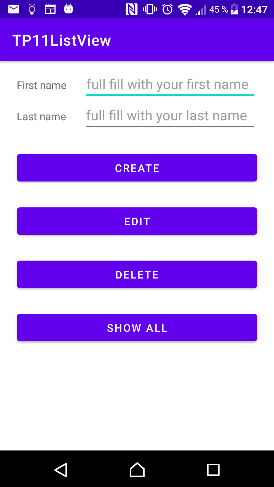
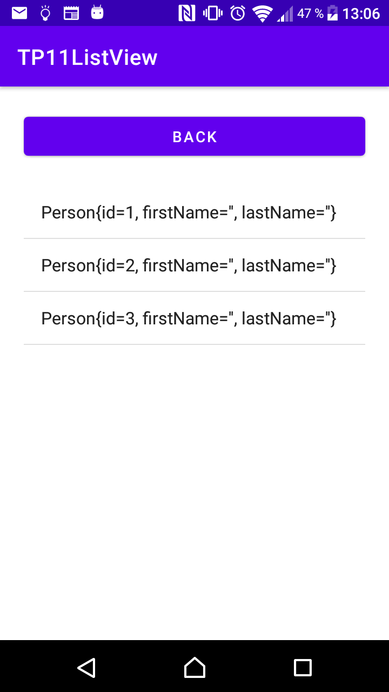
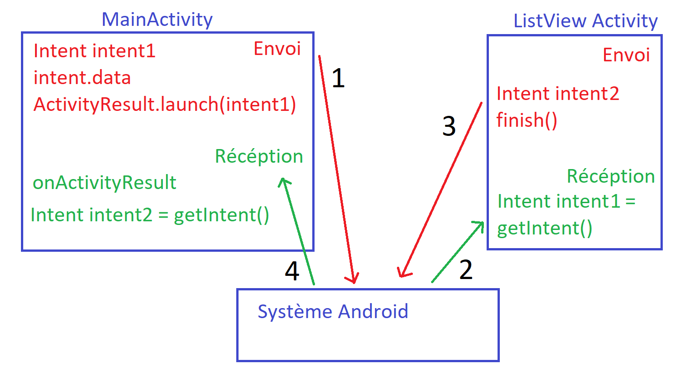

= TP11 Android ListView

=== branch one_button_save
version avec un bouton.

=== exo sur la branche master
utiliser 3 bouton en partant de la version un bouton
tel que le screen suivant: +
 +
MainActivity +

 +
 +
SecondActivity +

 +
 +

